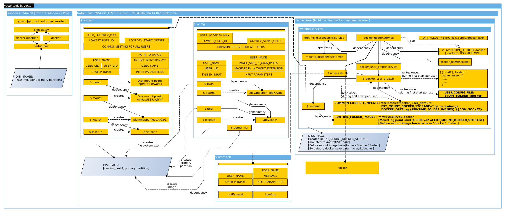

# *yocto-tools [Andrys Jiri, 2018.11.08, v0.76 ]*  

 Author        : Jiri Andrys  
 Maintainer    : Jiri Andrys  
 Contributors  : Jiri Andrys  
  
# 1. Contents:

* [2. Overview](#2-overview)
* [3. Getting Started](#3-getting-started) 
  * [3.1 Installation](#31-installation)
  * [3.2 Create Image](#32-create-image)
  * [3.3 Run Virtual Environment](#33-run-virtual-environment)
  * [3.4 Run Virtual Environment in Windows](#34-run-virtual-environment-in-windows)
* [4. Dependency List](#4-dependency-list)
* [5. Architecture](#5-architecture)
* [6. Buildmachine Setup](#6-buildmachine-setup)
  * [6.1 Buildmachine and Systemd Services](#61-buildmachine-and-systemd-services)
    * [Start/Stop docker-user service](#startstop-docker-user-service)
    * [Enable/Disable scheduled auto-umounts](#enabledisable-scheduled-auto-umounts)
    * [Manually unmount all yocto-tools's mounts](#manually-unmount-all-yocto-toolss-mounts)
* [7. Yocto-tools and Definition of Build Environment by dockerfiles](#7-yocto-tools-and-definition-of-build-environment-by-dockerfiles)


# 2. Overview
The `yocto-tools` helps to maintain multiple yocto environments/BSPs 
and hold host's dependencies in shape.
Package is designed for people who porting software to different boards
and also have intention to do something else than handling yocto.
Yocto environments are stored in virtual disks in raw format.
Images are mapped with help of loopback devices.
Loop devices are slow in comparison with native write.
Separation of BSPs to images ease switching between them.

If you do something with yocto/poky/openembedded then you know that
initial build take most of time and also take a lot of space on storage.
Yocto-tools stores this data in virtual disks.  
After first initialization of yocto,
location and linux ACLs mappings have to remain the same.
In case that we are working with more than one BSP it is difficult
to handle multiple environment such as move BSP to different machine
or reuse huge image without necessity to rebuild entire yocto.  
Because of all data are stored in images it is easy to handle it or
map it from NAS to any system ("ymount").
In result user can copy virtual disk to any machine(windows, linux)
then just continue work without necessity to recreate entire yocto-environment.  
Moreover, it is also possible to use yocto environment of someone else, 
just copy virtual disk to any machine and continue working.    

  
Yocto-tools fully support build machine concept(one common machine for builds).  
Develepers usually do not want to create magical releases, 
where nobody knows what is necessary for build
and windows/"mail machines" usually differs from machines where devel is done.
On user's windows/"mail machine" there are usually no free resources. 

We suppose that build is made on PC/Machine where multiple users are logged in
and  multiple users are using yocto in parallel.
Tools allows access one user to multiple images, but one user per build is allowed.
Multiple builds can run in one build machine.
   
* Users have following mount points of yocto image:  
  **"/opt/$USER/works"**
  Here, bitbake should be called.
  Only in one yocto-image-environment user can build at time. 

*  Multiple images for given user are mounted in different paths:  
   **"/mnt/$USER/vdXXX"**  
   Please read help for ymount, for more details.  

*  **Yocto Data Image ---mount---> "/mnt/$USER/vdXXX"---bind--->"/opt/$USER/works"**

Different BSPs/"yocto-recipes" may use quite diferent attitude in sense of what cross compile means,
such as using direct headers from host instead of headers from yocto cross ,
or may need particular version of linux distro for cross ....  
We want to separate native linux system(build machine) from build environment.
Here comes reason for docker and docker-per-user ("docker_user").  
  
  
In short, we run `$ yocto cimg` and create image for yocto, then
we just call `yocto` command and docker  will make isolation for us.
From now on we don't need to care about linux distro in host (ubuntu 16.04, 12.04 etc..).
If we dont want to use docker then we can call only ymount and tool
will ask for path to yocto image as before.
Another advantage of using docker is that we can simply run yocto in Windows system.
In case of Windows we also need VirtualBox, 
hypervisors such as Hyper V are not supported.
Windows related depencencies such as docker-machine and docker 
will be installed with great help of chocolatey repository.
In Windows environment we can not use "ycimg", "ymount".  


Yocto-tools has been tested on following systems:  

 * Ubuntu 14.04(64bit)
 * Ubuntu 16.04(64bit with docker) 
 * Fedora 24(64bit)  


# 3. Getting Started 

## 3.1 Installation

**Released yocto-tools are located in "release" directory,
use this "release/yocto" file for any installation, the "src" directory
is only for making releases, it is only for developers.**

Yocto-tools can be installed two different ways.   
First is single-user mode, which will not install any systemd services.   
Second is multi-user mode/buildmachine mode which will install docker-user services,  
where every user will have own dockerd deamon.

Because of yocto-tools during installation copy files to system folders,  
given user have to be member of sudo group.   
Once tools are installed yocto-tools modify sudoerr file
and limit user only to yocto-tools, 
then general privileged rights(being member of sudo group) are not necessary
and we can remove given user from sudo group.  

**Before we start installation ACL's group called yocto-tools have to be created in host.**  

**In order to use yocto-tools user have to be member of yocto-tools ACL's group.**


1. In case of normal PC(linux), please call following command as normal user:  
>`$ ./yocto install --install-subsystem-files`

2. In case of multi-user environment(buildmachine, linux + systemd) and initial installation, 
   please call following command as normal user:  
>`$ ./yocto install --install-subsystem-files --install-services`

3. In case of multi-user environment(buildmachine, linux + systemd) and new user,
   please call following command as normal user:  
>`$ ./yocto install --install-services`

4. In case of windows OS please install cygwin and git, curl and awk package, 
then in cygwin shell just call :  
>`$ ./yocto install `  
  The rest of tools such as docker will be installed from "chocolatey repository"

Note.: 
   Characters "./" are important, please do not skip them during installation.


## 3.2 Create Image
>`$ yocto cimg`  


## 3.3 Run Virtual Environment
- After following command user will appear in docker environment, 
  where we can run bitbake(**/opt/$USER/works/**)
- In case that we want to use docker or build virtual disk from someone else :  
>`$ yocto `  


- In case that we do not want to use docker, and host system have all dependencies then 
  user can only mount virtual disk:
- If user build yocto environment out of docker, Yocto toolchain will be created for host's env,
  therefore this is not suggested approach, unless given user knows yocto/oe/toolchain well ! 
>`$ ymount `  


## 3.4 Run Virtual Environment in Windows
>`$ yocto `  


# 4. Dependency List

1. Standard tools, included in almost all kind of distros and installed by default:  
   >` bash, mkdir, chmod, chown, mount, grep, egrep, awk, id, base64, bunzip2, lsof`  

2. Additional tools:  
   >` losetup, kpartx, smbstatus, smbcontrol, docker, git, qemu-img, df`

3. In case of Windows System:  
   >` cygwin env. and also git, curl, awk packages. 
   Docker, VirtualBox, docker-machine will be installed automatically. ` 


# 5. Architecture





# 6. Buildmachine Setup

When we select **--install_services** during installation step,  
systemd services related to docker per user("docker_user") will be installed.  
This means that every user have separated:  

- dockerd deamon and its startup parameters
- private storage for docker images(virtual env. where yocto will run)

Private storage for docker images are stored separated 
as virtual disks and are always mounted to user's last mount point id.  
Number of mount points depends on settings of ymount 
and can be changed per buildmachine.  

- Default value of maximal number of mount points is 3.  
  This is also maximal number of mounted virtual disk at time  
  per user by yocto-tools/ymount.
- First mount point is **"/mnt/$USER/vd0"** and is used during build of yocto.  
  (working yocto-env where user build yocto)
- Second mount point is **"/mnt/$USER/vd1"** and purpose is us up to user.
- Last mount point is **"/mnt/$USER/vd2"** and is used by docker(docker_user),  
  in case of buildmachine installation.  
  Location of virtual disk for docker images is :  
**EXT_MOUNT_DOCKER_STORAGE="/*/docker_imgs_storage.qemurawimg"**   
  This virtual image can be created automatically during buildmachine installation.
- In order to protect data on mounted virtual disks, 
  "mounts_disconects@$USER.service" is installed 
  and provides unmouting of all virtual disks.
  Another  unit mounts_disconects@$USER.timer serve as trigger.
  Default trigger time is set to 22:45 . 

We suppose that somewhere in NAS in network we have common place to store all images for all "build-users".  
After "Buildmachine" ops install yocto-tools's services for user, then dockerd setings is located in  
**"${HOME}/.config/docker_user/docker"**.


User settings is not hard-coded. Settings is templated per buildmachine.  
During first buildmachine installation by admin location of virtual disk for docker images
will be defined.  
Yocto-tools asks for location and store settings in:   
**"/etc/default/docker_user_default"**  
This file will be used as template during following service-only installation.
In order to update all tools admin of buildmachine should run:  

```
$ yocto install --install-subsystem-files --install-services  
```   

During install we should not replace **docker_user_default**.  

Please take a look to architecture(doc folder) and to sources in order to understand well.


## 6.1 Buildmachine and Systemd Services


### Start/Stop docker-user service
```
$ sudo systemctl start docker_user@$USER.service
```  
```
$ sudo systemctl stop docker_user@$USER.service
```   


### Enable/Disable scheduled auto-umounts
```   
$ sudo systemctl enable mounts_disconects@$USER.timer
```   
```   
$ sudo systemctl disable mounts_disconects@$USER.timer
```   


### Manually unmount all yocto-tools's mounts
```
$ sudo systemctl start mounts_disconects@$USER.service
```  


# 7. Yocto-tools and Definition of Build Environment by dockerfiles

As have been described before, docker provide isolation from host's env.  
Definition of running environment for yocto build is stored in dockerfiles  
located in following directory:  
**`${HOME}/.config/yocto_docker/build_*`**  
During start of yocto-tools by **$ yocto** command user will choose from docker-user files.  
Definition of running environment is composed from two dockerfiles:  
   
   
1. **"\*yocto_base.v\*.docker"** :
   - Should not be modified and contains most of data
   - In order to speed up process and also for offline mode(yocto offline build)
   - Prepared image can be stored as **"\*yocto_base.v\*.docker.tar.bz2"**
     During installation, yocto-tools check docker-image-file in current directory
     and if exist copy it to user's folder for later use. 
   

2. **"\*yocto_user.v\*.docker"** :
   - On base of yocto_base docker file
   - User can copy this file and modify it 
   - In order to rebuild image with same name of dockerfile  
     old image have to be removed from docker 

     
**Note.:  
Sudo password inside all containers is stored in following file in container:
/userpassword**
